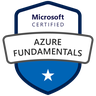
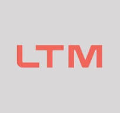

<<<<<<< HEAD
Hello there! 👋

I'm [**Aryan Kumar**](https://aryankr.in)   
**Software Engineer | Full Stack & AI**
> Open to software engineering, full stack, and AI-focused roles and collaborations - let's talk.

I build software that respects the user tools that run on your own machine, keep your data private, and keep working without a network. My stack is TypeScript, Python, JavaScript, React, and Node.js, with LLMs where they genuinely add value.

Currently at LTIMindtree, I design, and build scalable web applications, working across the stack with TypeScript, JavaScript, React, Node.js, sql, Python and Azure. IFocused on code quality, maintainability, and end-to-end feature delivery, with an emphasis on collaborative development, code reviews, and reliable software deployment.

Right now I'm working on [Locus](https://github.com/aryanjsx/Locus), a private, offline-first assistant for your PC that runs spoken or typed commands locally. 

I also built [know-India](https://github.com/aryanjsx/know-India). Know India is a full-stack tourism and cultural discovery platform that I understand you have been building since 2021. Its purpose is to help people explore India's geography, heritage, traditions, festivals, cuisine, and tourist destinations through one interactive platform.
But the deeper idea is not simply to create another travel website. It's to make India easier to understand before someone decides where to travel.

Check out my [portfolio](https://aryankr.in) for more of my work, read my posts on [Medium](https://aryanjsx.medium.com/), or reach out to me at <me@aryankr.in>

[LinkedIn](https://linkedin.com/in/aryanjsx) · [X](https://x.com/aryanjsx) · [LeetCode](https://leetcode.com/aryanjsx) · [GeeksforGeeks](https://www.geeksforgeeks.org/user/aryanjsx/) · [Instagram](https://instagram.com/aryanjsx)

    