### selected work

→ [all repositories](https://github.com/aryanjsx?tab=repositories)

### elsewhere

[aryankr.in](https://aryankr.in) · [LinkedIn](https://linkedin.com/in/aryanjsx) · [Medium](https://aryanjsx.medium.com/) · [LeetCode](https://leetcode.com/aryanjsx) · [GeeksforGeeks](https://www.geeksforgeeks.org/user/aryanjsx/) · [Instagram](https://instagram.com/aryanjsx) · [me@aryankr.in](mailto:me@aryankr.in)

